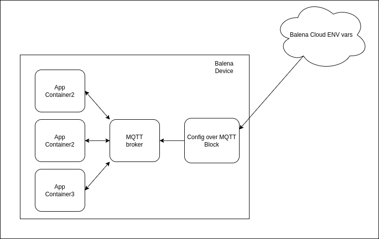

# Config Over MQTT Block

*Easily send configuration to your apps without the need to restart the container*



Config Over MQTT Block allows you to send configuration parameters to your application containers via a MQTT message. You setup your application to listen for the message on a "config" topic and add environment variables to this block on balenaCloud and they will be automatically forwarded.


## Getting started

You first must ensure you have a valid MQTT broker set up, this can be [the MQTT broker block](https://hub.balena.io/organizations/william_love/blocks/docker-mosquitto-amd64) or an external broker. Then add this block to your application and on this block environment variables set properly `MQTT_HOST`(defaults to `localhost`) and `MQTT_PORT` (defaults to `1883`). 

Now you can set any environment variable with the prefix `CFG_MQTT_` and everytime any of these variables change, the config block will bootstrap and send a stringified JSON message containing each of the variables such as, if you have the following environment variables on balenaCloud:

```
CFG_MQTT_DB_NAME='test'
CFG_MQTT_DB_HOST='my.domain'
CFG_MQTT_DB_SECRET='myS3cret'
```

The following message will be sent to the `config` topic on the broker:

```json
{
  "DB_NAME": "test",
  "DB_HOST": "my.domai",
  "DB_SECRET": "myS3cret"
}
```

This variables can be set either on the application `docker-compose.yml` such as:

```yaml
  config-over-mqtt:
    build: bh.cr/otavio_jacobi/config-over-mqtt
    network_mode: host
    environment:
      MQTT_HOST: "my.mqtt.host"
      MQTT_PORT: 1883
      CFG_MQTT_DB_NAME: "test"
      CFG_MQTT_DB_HOST: "my.domain"
      CFG_MQTT_DB_SECRET: "myS3cret"
```

And then overwritting these variables or adding new ones on the dashboard will cause this container to restart and send the config message to the config broker.

__Note__: When adding new variables via the dashboard be sure to only add this new variable to the config blog otherwise it will cause a restart on the other services aswell.